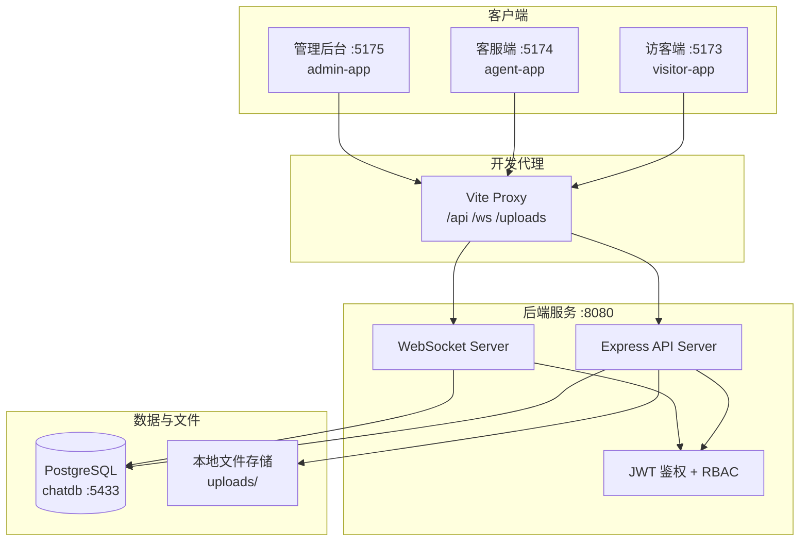

# Visitor Chat Hub — 系统架构与功能描述

## 一、系统概述

**Visitor Chat Hub** 是一套面向企业的在线客服系统，采用「访客端 + 客服工作台 + 管理后台 + 统一 API」的多端架构。访客通过专属链接发起咨询，客服实时接待，超级管理员在后台统一管理账号、权限与运营数据。

核心特点：

- **多租户式接待**：每位客服拥有独立 ID 与专属访客链接（`/chat/{agentId}`）
- **实时通信**：WebSocket 推送消息，REST API 负责业务逻辑
- **RBAC 权限**：普通客服与超级管理员分级，API 层统一鉴权
- **Monorepo 工程**：前后端、共享库、OpenAPI 规范同仓维护

---

## 二、系统架构



### 运行时拓扑（Docker Compose 开发环境）

| 服务 | 端口 | 说明 |
|------|------|------|
| `visitor-web` | 5173 | 访客聊天页 |
| `agent-web` | 5174 | 客服工作台 |
| `admin-web` | 5175 | 超级管理员后台 |
| `api` | 8080 | REST + WebSocket |
| `chat-postgres` | 5433 | PostgreSQL 数据库 |

前端通过 Vite 将 `/api`、`/ws`、`/uploads` 代理到 API 服务。**Windows 开发环境建议使用 `http://127.0.0.1` 访问**（避免 `localhost` 与 WSL 端口冲突）。

---

## 三、技术栈

| 层级 | 技术 |
|------|------|
| 前端 | React 19、Vite 7、Tailwind CSS 4、Wouter、TanStack Query |
| 后端 | Node.js、Express、WebSocket (ws)、JWT、bcrypt |
| 数据库 | PostgreSQL、Drizzle ORM |
| 规范与类型 | OpenAPI 3、Zod 校验、Orval 生成 API Client |
| 工程 | pnpm Monorepo、Docker Compose、SQL 迁移脚本 |

---

## 四、Monorepo 目录结构

```
Visitor-Chat-Hub/
├── apps/
│   ├── visitor-app/      # 访客端
│   ├── agent-app/        # 客服工作台
│   └── admin-app/        # 管理后台
├── artifacts/
│   ├── api-server/       # 后端 API + WebSocket
│   └── chat-app/         # 早期单体前端（保留）
├── lib/
│   ├── api-spec/         # OpenAPI 规范
│   ├── api-zod/          # 请求/响应 Zod Schema
│   ├── api-client-react/ # 前端 API 客户端 + React Hooks
│   ├── db/               # Drizzle 数据库 Schema
│   └── permissions/      # RBAC 权限定义
├── packages/
│   ├── ui/               # 共享 UI 组件（shadcn 风格）
│   └── vite-config/      # 统一 Vite 配置
├── scripts/
│   ├── migrations/       # 001–011 数据库迁移
│   └── docker-ensure-deps.sh
└── docker-compose.yml
```

---

## 五、角色与权限（RBAC）

| 角色 | 标识 | 能力概要 |
|------|------|----------|
| 普通客服 | `agent` | 登录客服工作台；接待分配给自己的会话；管理个人常用语与资料 |
| 超级管理员 | `super_admin` | 拥有客服全部能力 + 管理后台；可查看/接管全部会话；管理所有客服与常用语 |

权限在 `@workspace/permissions` 中集中定义，API 中间件（`requireAuth`、`requireSuperAdmin`、`requirePermission`、`requireSessionAccess`）在路由层强制执行。

### 权限清单

| 权限标识 | 说明 | 普通客服 | 超管 |
|----------|------|:--------:|:----:|
| `admin:access` | 访问管理后台 | — | ✓ |
| `agents:manage` | 客服账号管理 | — | ✓ |
| `sessions:read:all` | 查看全部会话 | — | ✓ |
| `sessions:read:own` | 查看自己的会话 | ✓ | ✓ |
| `sessions:takeover` | 强制接管会话 | — | ✓ |
| `sessions:reply` | 回复消息 | ✓ | ✓ |
| `messages:read:all` | 查看全部聊天记录 | — | ✓ |
| `messages:read:own` | 查看自己的聊天记录 | ✓ | ✓ |
| `quick_replies:manage:own` | 管理个人常用语 | ✓ | ✓ |
| `quick_replies:manage:all` | 管理全部常用语 | — | ✓ |

---

## 六、功能模块（按迭代阶段）

### P0 — 权限与管理后台基础

- 超级管理员登录管理后台（仅 `super_admin` 可登录）
- 客服账号 CRUD：创建、编辑、停用、删除、重置密码
- **自定义客服 ID**：创建时可指定 ID，用于访客专属链接
- 角色权限矩阵展示
- 管理后台个人中心：资料修改、自助改密

### P1 — 快捷回复

- 客服个人常用语（增删改查）
- 超管全局常用语管理
- 工作台快捷回复面板，一键插入消息

### P2 — 未读与会话状态

- 会话未读计数（访客/客服双向）
- 已读水位线同步
- 工作台会话列表未读角标

### P3 — 客服体系增强

- 客服个人信息：昵称、头像（访客端即时展示）
- 客服在线状态（`lastSeenAt` 心跳）
- 会话备注（内部笔记，仅客服可见）
- 访客专属链接与二维码分享

### P4 — 会话转接

- 客服将会话转接给其他客服
- 转接历史记录
- 管理后台转接记录查询

### P5 — 文件消息

- 图片/文件上传（最大 20MB，扩展名黑名单）
- 上传进度条与取消
- 消息中展示文件卡片（图片预览、文件下载）

### P6 — 系统日志

- 审计日志：登录成功/失败、客服 CRUD、密码重置/修改、会话转接
- 管理后台日志页：筛选、刷新、详情展示

### 规划中（P7）

- 管理后台数据统计与运营分析 Dashboard

---

## 七、核心业务流

### 1. 访客咨询流程

```
访客打开 /chat/{agentId}
    → 填写昵称（本地持久化访客身份）
    → POST 创建会话（绑定目标客服）
    → WebSocket 连接并 join 房间
    → 实时收发文字/图片/文件消息
```

### 2. 客服接待流程

```
客服登录 /agent
    → JWT 写入 localStorage
    → Dashboard 展示会话列表（含未读）
    → 选中会话 → WebSocket/REST 回复
    → 可选用快捷回复、添加内部备注、转接会话
```

### 3. 管理流程

```
超管登录 /login
    → 管理客服账号、常用语、查看全部会话
    → 查看转接记录与系统日志
    → 个人中心维护资料与密码
```

---

## 八、数据模型（核心表）

| 表名 | 用途 |
|------|------|
| `agents` | 客服/超管账号（用户名、密码哈希、角色、昵称、头像、在线状态） |
| `sessions` | 会话（访客昵称、绑定客服、最后活跃时间、未读计数） |
| `messages` | 消息（文本/图片/文件，含 `file_url`、`mime_type` 等） |
| `session_notes` | 会话内部备注 |
| `session_transfers` | 转接记录 |
| `quick_replies` | 快捷回复（个人或全局） |
| `system_logs` | 系统审计日志 |

数据库迁移由 `scripts/migrations/001`–`011` 顺序管理，Docker 启动时自动执行。

---

## 九、API 与实时通信

### REST API（部分）

| 分类 | 端点示例 |
|------|----------|
| 公开 | `GET /agents/:id`、会话创建、访客消息 |
| 客服 | `POST /agent/login`、`GET/PATCH /agent/me`、`PATCH /agent/me/password` |
| 管理 | `/admin/agents`、`/admin/logs`、`/admin/transfers` |
| 上传 | `POST /api/upload/image`、`POST /api/upload/file` |

完整规范见 `lib/api-spec/openapi.yaml`。

### WebSocket（`/ws`）

- 消息类型：`join`、`message`、`typing`、`read` 等
- 房间按 `sessionId` 广播
- 客服消息需 JWT 鉴权并校验会话访问权限

---

## 十、安全设计

- 密码 bcrypt 哈希存储，禁止明文
- JWT Bearer Token，客服/超管分端存储（`agent_token` / `admin_token`）
- 超管接口统一 `requireSuperAdmin`
- 会话访问按「本人会话 or 超管」校验
- 文件上传类型与大小限制
- 关键操作写入 `system_logs` 审计

---

## 十一、默认测试账号

| 端 | 账号 | 密码 | 说明 |
|----|------|------|------|
| 管理后台 | `admin123` | `123456` | 超级管理员 |
| 客服工作台 | `lele` | `123456` | 普通客服 |

---

## 十二、仓库信息

- GitHub：https://github.com/weichenz737/Visitor-Chat-Hub
- 部署说明：见 [DEPLOYMENT.md](./DEPLOYMENT.md)

---

## 十三、本地开发与部署

> 数据库为 **启动时自动初始化**（Drizzle push + SQL 迁移 + seed），无需手工导入 SQL 备份。完整步骤见 [DEPLOYMENT.md](./DEPLOYMENT.md)。

### 启动

```bash
docker compose up -d
```

### 访问地址

| 端 | URL |
|----|-----|
| 访客端 | http://127.0.0.1:5173 |
| 访客聊天（示例） | http://127.0.0.1:5173/chat/2 |
| 客服端 | http://127.0.0.1:5174/agent |
| 管理后台 | http://127.0.0.1:5175 |

### 手动应用迁移

仅在自动迁移失败时使用，详见 [DEPLOYMENT.md](./DEPLOYMENT.md)。

### 前端缓存问题

Docker + Windows 卷挂载可能导致 Vite 缓存旧代码。若 UI 未更新：

```powershell
docker exec visitor-chat-hubzip-admin-web-1 rm -rf /app/apps/admin-app/node_modules/.vite
docker restart visitor-chat-hubzip-admin-web-1
```

客服端、访客端同理，替换对应容器名即可。
